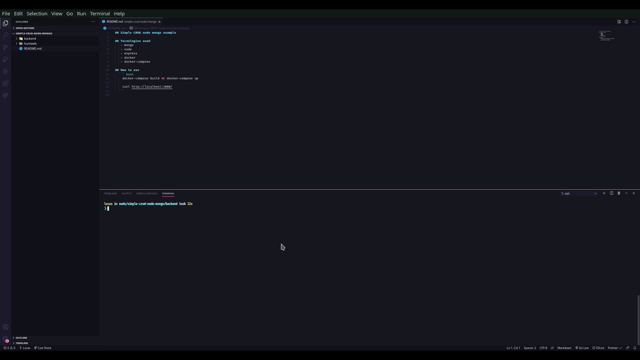

## Simple CRUD node mongo example 
  
  
## Tecnologies used
   - mongo
   - node
   - express
   - docker
   - docker-compose
   - React
   - React Router
   - React Router DOM

## How to use
  ``` bash
    docker-compose build && docker-compose up

    curl http://localhost:3000/
  ```
  
